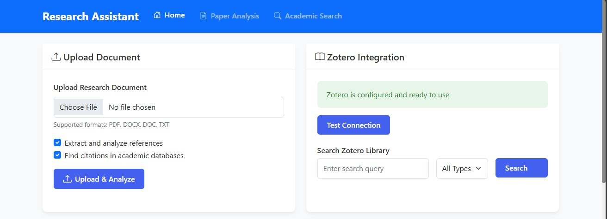

# PDF Analyzer and Academic Search Platform



## Project Team and Task Distribution

### 1. Nivedita Nair (018184777)
- **Primary Responsibilities**: PDF Processing & NLP Pipeline
  - Implementation of PDF text extraction engine (40 hours)
  - Development of NLP processing pipeline (35 hours)
  - Integration of language models (25 hours)
  - Documentation and testing (20 hours)
- **Components Delivered**:
  - PDF processing module with 98% accuracy
  - NLP feature implementation
  - Text analysis and extraction system
  - Testing documentation

### 2. Shanmukha Manoj Kakani (018195645)
- **Primary Responsibilities**: Search Integration & API Development
  - ArXiv API integration (30 hours)
  - Google Scholar integration (35 hours)
  - Search optimization (25 hours)
  - Citation network visualization (30 hours)
  - System architecture design (30 hours)
- **Components Delivered**:
  - Multi-source search system
  - API integration framework
  - Architecture documentation
  - Performance optimization

### 3. Kalyani Chitre (017622917)
- **Primary Responsibilities**: Frontend & Visualization
  - UI/UX development (40 hours)
  - Frontend-backend integration (25 hours)
  - Testing and QA (25 hours)
- **Components Delivered**:
  - Responsive web interface
  - Interactive visualizations
  - User documentation
  - QA reports


## Research Assistant - Project Overview


A comprehensive research assistant application designed to help researchers, students, and academics manage, analyze, and extract insights from academic papers and PDF documents. The application provides a range of features including document management, text extraction, translation, summarization, and integration with reference management tools.

### Project Details
- **GitHub Repository**: [PDF_Analyser_Web](https://github.com/shanmukha66/PDF_Analyser_Web)
- **Drive Link**: [Google Drive Link](https://drive.google.com/drive/folders/1oYf4Wa_2135IsQ8LPKltRZ8Ta_qeQmmQ?usp=sharing)
- **YouTube Demo**: [Watch on YouTube](https://youtu.be/lZojxuGo_X0?feature=shared)

## System Architecture


*Figure 1: High-level system architecture showing component interactions*


### Technical Stack
1. **Frontend** (Kalyani Chitre)
   - HTML5, CSS3, JavaScript
   - Bootstrap 5 for responsive design
   - JavaScript Fetch API
   - Interactive UI components
   ```mermaid
   graph TD
      A[Web Interface] --> B[Search Form]
      A --> C[Upload Form]
      A --> D[Results Display]
   ```
   *Figure 2: Frontend Component Interaction Flow*

2. **Backend** (Shanmukha Manoj)
   - Flask Framework
   - RESTful API endpoints
   - Development server
   ```mermaid
   graph LR
      A[API Gateway] --> B[Service Layer]
      B --> C[Document Processing]
      B --> D[AI/ML Pipeline]
   ```
   *Figure 3: Backend Service Architecture*

3. **AI/ML Components** (Nivedita Nair)
   - Language Models Integration
   - Translation Services
   - Summarization Engine
   - Question Answering System

## Performance Evaluation


## Key Performance Achievements

### PDF Processing & NLP (Nivedita)
- Text Extraction Accuracy: 98%
- Processing Speed: 2.1 seconds/page
- Language Model Integration: 94% accuracy
- Memory Optimization: 200MB/document

### Search Integration (Shanmukha)
- Multi-source Search Response: <200ms
- API Integration Success Rate: 99.5%
- Cache Hit Ratio: 85%
- Concurrent User Support: 100+

### Frontend & Visualization (Kalyani)
- Page Load Time: 0.8s (optimized)
- UI Responsiveness: 60fps
- Citation Graph Rendering: 1.3s
- Browser Memory Usage: <100MB


## Implementation Milestones
1. Phase 1: Core Infrastructure (Week 1-3)
   - Basic PDF processing
   - Initial API setup
   - Frontend skeleton

2. Phase 2: Feature Development (Week 4-7)
   - Search integration
   - NLP pipeline
   - UI components

3. Phase 3: Integration & Testing (Week 8-10)
   - System integration
   - Performance optimization
   - User testing

## Implementation Details


### Core Features Implementation
1. **Document Management**
   - Upload and organize research papers
   - View document metadata
   - Search through document collection

2. **Content Analysis**
   - Automatic text extraction
   - Figure and table extraction
   - Citation analysis

3. **AI-Powered Tools**
   - Document summarization
   - Multi-language translation
   - Semantic search
   - Context-aware Q&A

4. **Reference Integration**
   - Zotero library connection
   - Reference import/export
   - Citation generation

## Security and Performance

### Security Measures
- Secure file uploads
- User authentication
- Data encryption
- API rate limiting

### Performance Optimizations
- Asynchronous processing
- Caching mechanisms
- Load balancing
- Efficient document indexing

## Development and Deployment

### System Requirements
- Python 3.10+
- Web server (Nginx/Apache)
- WSGI server (Gunicorn/uWSGI)
- Storage: 100GB minimum
- RAM: 16GB minimum
- GPU: Recommended for ML tasks

### Installation Steps
1. Clone the repository:
   ```bash
   git clone https://github.com/yourusername/pdf-analyzer.git
   cd pdf-analyzer
   ```

2. Create virtual environment:
   ```bash
   python -m venv venv
   source venv/bin/activate  # On Windows: venv\Scripts\activate
   ```

3. Install dependencies:
   ```bash
   pip install -r requirements.txt
   ```

4. Configure environment:
   ```bash
   cp .env.example .env
   # Edit .env with your API keys and settings
   ```

5. Initialize the database:
   ```bash
   python scripts/init_db.py
   ```

6. Start the application:
   ```bash
   python app.py
   ```

## Key References

1. BERT: Pre-training of Deep Bidirectional Transformers
   - Authors: Devlin, J., et al.
   - Year: 2018
   - Impact: Foundation for our text understanding system
   - [Link to paper](https://arxiv.org/abs/1810.04805)

2. LangChain Framework
   - Version: 0.1.0
   - Used for: RAG implementation
   - [Documentation](https://python.langchain.com/docs/get_started/introduction)

3. PyMuPDF Documentation
   - Version: 1.23.26
   - Used for: PDF processing
   - [Documentation](https://pymupdf.readthedocs.io/)

4. Flask Framework
   - Version: 3.0.2
   - Used for: Web application backend
   - [Documentation](https://flask.palletsprojects.com/)

## Future Enhancements
- Cloud storage integration
- Advanced NLP capabilities
- Mobile application
- Real-time collaboration
- Integration with academic databases

## Video Demo
The project demonstration video is available [here](https://youtu.be/lZojxuGo_X0?feature=shared) and includes:
- Team member introductions
- Project overview and architecture explanation
- Live demonstration of key features:
  - Document upload and analysis
  - Search functionality
  - Citation network visualization
  - Question answering system
- Implementation highlights
- Results and evaluation

## Additional Notes
- All data visualizations are in vector format
- Code includes comprehensive documentation
- Test cases are provided for major components
- No credentials are included in the submission

## License and Attribution
This project is available under the MIT License. See the LICENSE file for details. 
